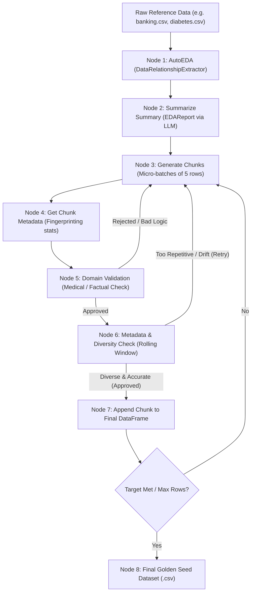

# 🧬 GenData: Agentic Synthetic Data Engine (Golden Seed Framework)

> **"Data chahiye par real data sensitive hai ya exist hi nahi karta? Simple prompt se LLM bakwas data deta hai. GenData usko ek scientific, self-correcting feedback loop me daal kar perfect 'Golden Seed' data banata hai."**

---

## ⚡ 30-Second Elevator Pitches (Kisi ko batana ho toh)

### 👔 Executive / Resume / Client Pitch (Buzzwords Pack)
> *"GenData is an **Agentic Tabular Data Synthesis Pipeline** built with **LangGraph** and **Pydantic**. It leverages an automated **Closed-Loop Feedback Mechanism** with **Rolling Statistical Fingerprinting** and multi-LLM orchestration (Groq, Gemini, OpenRouter) to autonomously generate high-fidelity, distribution-accurate, and constraint-compliant **'Golden Seed' datasets** without privacy or PII risks."*

### ☕ Chai Pe Dosti Wala Pitch (Banda Samajh Jaye)
> *"Bhai dekh, agar tu ChatGPT ko bolega '1000 diabetes patients ka data bana', toh wo repetitive, fake aur unrealistic data fenk dega (jaise 5 saal ke bacche ko 20 saal se high BP). GenData kya karta hai: pehle asli data ka mathematical DNA (correlations, averages, ranges) samajhta hai. Fir 5-5 row karke generate karta hai, har batch ka digital fingerprint (stats) check karta hai, aur agar koi row kharab nikli toh khud ko advice dekar dubara theek karta hai. Jab tak 100% solid master seed na ban jaye, ye loop chalta rehta hai."*

---

## 🎯 Asli Problem Kya Hai? (Why does this exist?)

Jab bhi AI/ML models train karne hote hain (Healthcare, Banking, Finance), do badi deewarein aati hain:
1. **Privacy & Compliance (GDPR/HIPAA):** Asli patient ya customer data use nahi kar sakte.
2. **LLM Hallucination & Mode Collapse:** LLM se seedha table mangwaoge toh:
   - Rows aapas me repetitive ho jayengi (diversity khatam).
   - Real-world correlations toot jayenge (e.g., Glucose badhega toh Insulin ka pattern kya hoga?).
   - 100 rows ke baad LLM context forgetfulness ya distribution drift dikhane lagta hai.

### Solution: The "Golden Seed" Strategy
Pura 10 lakh rows ka data ek jhatke me LLM se generate karna bewakoofi hai. Sahi tareeqa hai:
1. Ek **Golden Seed** (100–500 rows ka hyper-accurate, verified, mathematically sound dataset) banao.
2. Is golden seed ko foundation maan kar aage CTGAN, TVAE, ya traditional statistical synthesizers se millions of rows scale kar lo.

**GenData is Golden Seed banane ki process ko 100% autonomous agentic pipeline banata hai.**

---

## 🏗️ Architecture & How It Works (Kaise Kaam Karta Hai)

GenData ek **Stateful Directed Acyclic/Cyclic Graph (LangGraph)** ke roop me kaam karta hai.



---

## 🔍 Deep-Dive: Step-by-Step Breakdown

### Step 1: Real Data Ka DNA Nikalna (`AutoEDA.py`)
- Pehle reference dataframes ko read kiya jata hai.
- **Univariate Stats:** Mean, Median, Min, Max, Skewness, Zero-count distribution.
- **Multivariate Correlations:** Pearson correlation matrix (jaise BMI vs BloodPressure, Age vs Income).
- **Categorical Crosstabs:** Categorical values ke aapas ke frequency distributions.
- Ye sab statistical facts nikal kar ek clean **`EDAReport`** Pydantic schema me compress ho jate hain.

### Step 2: Multi-LLM Fallback Engine
API rate limit ya downtime se bachne ke liye cascade system hai:
$$\text{Groq (LLaMA 3.3 70B)} \longrightarrow \text{Google Gemini (2.0 Flash)} \longrightarrow \text{OpenRouter}$$
Agar pehla model fail hota hai, pipeline break nahi hoti; agla model charge le leta hai.

### Step 3: Micro-Batch Generation (`generate_chunks`)
- Ek saath 1000 rows nahi, balki **chote micro-chunks (e.g., 5 rows)** generate hote hain.
- Pydantic models (jaise `DiabetesRecord`) strict validation enforce karte hain:
  - `age`: `ge=0, le=120`
  - `exercise_frequency`: Literal["Sedentary", "Low", "Moderate", "High"]
  - `glucose_level`: Float, logically aligned.
- Prompt me automatically pichli validation ki advice aur reference stats embed hote hain.

### Step 4: Statistical Fingerprinting (`get_chunk_metadata`)
- Har naye 5 rows ka turant on-the-fly math nikala jata hai:
  - Numerical `.describe()`
  - Categorical `.value_counts(normalize=True)`
- Isko kehte hain **Chunk Fingerprint**.

### Step 5: Two-Level Guardrails (Dohri Jaanch)
1. **Factual / Domain Sanity Check:**
   - Kya medical logic sahi hai? (e.g., normal patient ka fasting glucose 900 toh nahi dikha diya?).
2. **Entropy & Historical Comparison Check:**
   - Naya chunk pichle 5 chunks ke fingerprints ke sath compare hota hai.
   - Dekha jata hai: *Kya data bohot zyada ek jaisa (identical/biased) ho raha hai?* Hume diverse data chahiye, copy-paste clone nahi.

### Step 6: Self-Correction Loop (The Real Magic)
- Agar validator kehta hai `mode='retry'`, toh wo sath me **`advice`** deta hai:
  > *"Glucose distribution is too skewed towards 180+. Generate rows with moderate 90-120 range."*
- Agle cycle me LLM is advice ko padhkar correction ke sath naye rows generate karta hai.
- Jab approve ho jata hai, chunk `final_df` me append ho jata hai!

---

## 📂 Project Directory Structure

```text
GenData/
├── C1_Diabetes/                   # Diabetes domain specific references & target summaries
│   ├── RelationshipSummary.md     # Pre-analyzed domain relationship notes
│   ├── Relationships.txt          # Target constraints & correlation values
│   └── ultra_detail_start.pdf     # SME ground truth research document
├── Data/                          # Input & Generated datasets
│   ├── banking.csv                # Financial domain reference dataset
│   ├── diabetes.csv               # Baseline clinical dataset
│   └── final_dataframe.csv        # Output generated golden seed
├── Sources and Planning/          # Core methodologies & workflow blueprint
│   ├── Steps.md
│   └── so now write a complete... # Step-by-step golden seed workflow design
├── tests/                         # Engine implementations
│   ├── AutoEDA.py                 # Automated feature & correlation extractor
│   ├── AutomatedGoldenSeed.py     # Main LangGraph agent state machine
│   ├── Validator.py               # Post-generation comparison & scoring engine
│   └── TempAMGS.py                # Experimental iterative generation scripts
└── README.md                      # Complete project documentation
```

---

## 💼 Interview & Tech Showcase Cheat-Sheet

| Sawal (Question) | Buzzword Answer (For Interviews / Clients) | Asli Desi Matlab (Under the hood) |
|---|---|---|
| **"What makes this different from ChatGPT prompting?"** | *"Closed-loop feedback with deterministic statistical fingerprinting instead of open-ended generation."* | Chatbot ko bolne par wo andha data phekta hai; yahan har 5 row par math check hota hai aur galat hone par regenerate hota hai. |
| **"How do you handle mode collapse / repetition?"** | *"Rolling-window entropy validation over historical chunk distributions."* | Pichle 5 batches ke averages se compare karke check karte hain ki model ek hi type ki rows toh repeat nahi kar raha. |
| **"How do you ensure data schema validity?"** | *"Strict Pydantic V2 schema enforcement with bounded domain validations."* | Har field ka type, min-max limit fix hai, random string ya invalid value aa hi nahi sakti. |
| **"What is the system architecture?"** | *"Stateful graph-based orchestration using LangGraph with multi-model redundancy."* | LangGraph ka flow diagram hai jo nodes me ghumta hai aur Groq/Gemini/OpenRouter me auto-switch karta hai. |

---

## 🚀 How to Run

1. **Environment Setup:**
   ```bash
   python -m venv myenv
   myenv\Scripts\activate
   pip install -r requirements.txt  # pandas, langgraph, langchain-groq, langchain-google-genai, pydantic, rich
   ```

2. **Setup API Keys in `.env`:**
   ```env
   GROQ_API_KEY="your_groq_api_key"
   GEMINI_API_KEY="your_gemini_api_key"
   OPENROUTER_API_KEY="your_openrouter_api_key"
   ```

3. **Run Golden Seed Generator:**
   ```bash
   python tests/AutomatedGoldenSeed.py
   ```

---

## 🏆 Key Takeaway
GenData dikhne me simple Python script lag sakti hai, lekin iska concept enterprise-grade hai: **"Trust, but mathematically verify every generated token."** Synthetic data tabhi kaam ka hai jab wo machine learning models ko train karne layak trustworthy ho!
